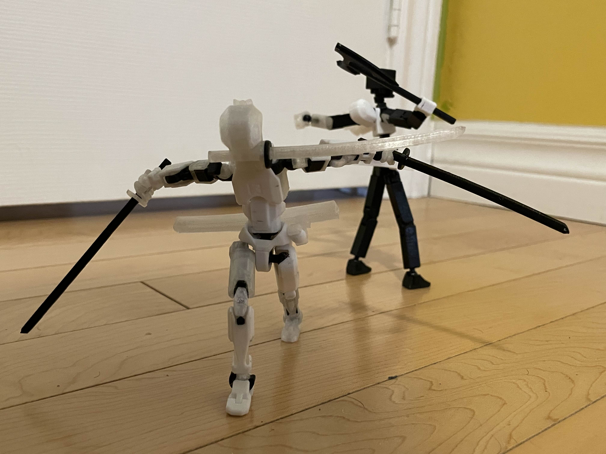

# One Piece designs for Dummy 13
These are designs for One Piece-related accessories for the Dummy 13 figure found on printables!

*You need access to a 3D printer to use these

## Where to find them?
**You can find my designs here as .STL files to transfer to your slicer or you can finnd them on my printables page**:
- [Usopp's Headband](https://www.printables.com/model/985252-dummy-13-usopps-headband)
- [Luffy's Straw Hat](https://www.printables.com/model/984163-dummy-13-luffys-straw-hat)
- [Blank Chest Plate](https://www.printables.com/model/984041-dummy-13-blank-chest-plate) (this is not One Piece spcific but just to remove the unrelated 13 from the figure's chest)
- [Zoro's Headband](https://www.printables.com/model/983976-dummy-13-zoros-headband)
- [Zoro's 3 Sword Style Head](https://www.printables.com/model/983945-dummy-13-zoro-head)

## How to use them:
Just throw 'em into your slicer and they're ready to print!

## Extra Stuff
Here's a [link](https://www.printables.com/@mando13_1132886/models) to my printables page where you can see all the models I've designed!

## License
This project is licensed under the MIT license and can be found at [LICENSE](LICENSE)
